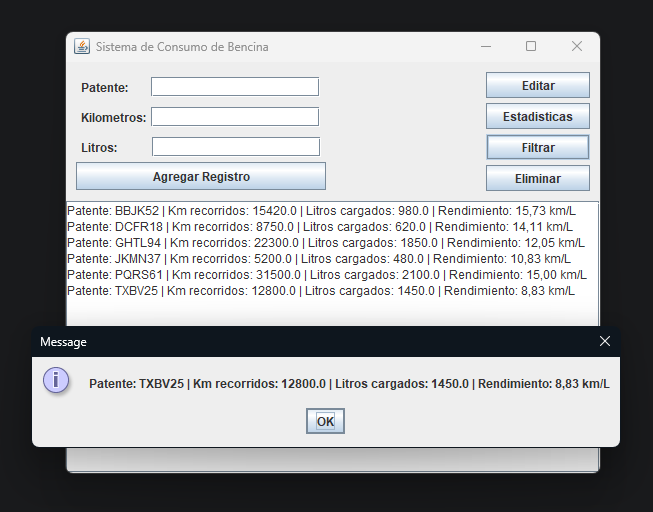

# Fuel Consumption Tracker

A desktop Java + Swing application to track vehicle fuel consumption and calculate fuel efficiency (km/L).

Developed as the Final Transversal Evaluation (EFT) for the Programming Fundamentals course at DuocUC.

## Features

- Register vehicles with license plate, kilometers driven, and liters loaded
- Edit and delete existing records
- Automatically calculate fuel efficiency (km/L) for each vehicle
- Display statistics: average, maximum, and minimum efficiency
- Filter vehicles with low efficiency (< 10 km/L)
- Automatic persistence to `registros.txt`

## Screenshot

## Project Structure

- `Main.java` — Swing GUI and business logic
- `Persistencia.java` — File read/write operations
- `Estadisticas.java` — Average and extreme efficiency calculations

## Requirements

- Java JDK 17 or higher
- IntelliJ IDEA (or any Java-capable IDE)

## How to Run

1. Clone the repository
2. Open the project in IntelliJ IDEA
3. Run `Main.java`

## Design Decisions

- **Fail-fast on corrupted file**: if `registros.txt` contains malformed lines, the program warns the user and exits instead of partially loading data, preventing inconsistent state.
- **Separation of concerns**: the `Persistencia` class is unaware of the GUI; exceptions propagate to `Main`, which decides how to notify the user.
- **Normalized plate validation** (trim + uppercase + alphanumeric only) to prevent duplicates caused by formatting differences.
- **Enter shortcut** from any input field to speed up record entry.

## Author

Pablo Smith — DuocUC, 2026